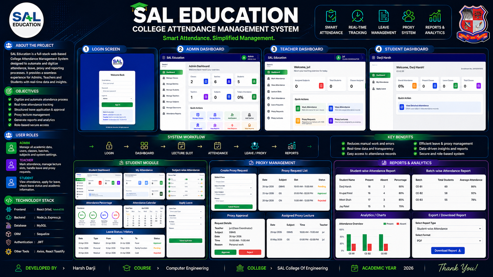

# SAL Education - Attendance Management System



A comprehensive College Attendance Management System built with React (Vite), Node.js (Express), and MySQL (Sequelize).


## 🚀 Features

- **Multi-Role Authentication**: Secure login for Admins, Teachers, and Students.
- **Admin Dashboard**: Manage Students, Teachers, Classes, Batches, and Subjects.
- **Attendance Tracking**: Teachers can mark and view attendance for theory and lab sessions.
- **Proxy Management**: Teachers can request and approve proxy lectures.
- **Student Portal**: Students can view their attendance reports and apply for leave.
- **Data Import**: Supports importing data via CSV and XML files.
- **Detailed Reports**: Comprehensive attendance reports for analysis.

---

## 🛠️ Tech Stack

- **Frontend**: React, Tailwind CSS, Vite
- **Backend**: Node.js, Express.js
- **Database**: MySQL, Sequelize ORM
- **Authentication**: JWT (JSON Web Tokens) with HTTP-only cookies

---

## 📦 Installation & Setup

Follow these steps to get the project running on your local machine.

### 1. Prerequisites
- [Node.js](https://nodejs.org/) (v16 or higher)
- [MySQL Server](https://dev.mysql.com/downloads/installer/) (e.g., XAMPP, MySQL Workbench)

### 2. Clone the Repository
```bash
git clone https://github.com/your-username/sal-attendance-system.git
cd sal-attendance-system
```

### 3. Install Dependencies
Install dependencies for both the root project (frontend) and the backend.

```bash
# Install root/frontend dependencies
npm install

# Install backend dependencies
cd backend
npm install
cd ..
```

### 4. Database Setup
1. Open your MySQL client (XAMPP/MySQL Workbench).
2. Create a new database named `sal_attendance`:
   ```sql
   CREATE DATABASE sal_attendance;
   ```

### 5. Environment Variables
1. Go to the `backend` folder.
2. Create a `.env` file from the `.env.example` file:
   ```bash
   cp .env.example .env
   ```
3. Update the `.env` file with your MySQL credentials:
   ```env
   DB_USER=root
   DB_PASSWORD=your_password
   JWT_SECRET=any_random_secret_string
   ```

### 6. Seed the Database
Run the seeder script to populate the database with initial data (Admin, Teachers, Classes, etc.).
```bash
cd backend
npm run seed
cd ..
```

---

## 🚦 Running the Project

You can start both the frontend and backend simultaneously from the root directory:

```bash
npm run dev
```

The application will be available at:
- **Frontend**: `http://localhost:5173`
- **Backend API**: `http://localhost:5000`

---

## 🔐 Login Credentials (After Seeding)

**Admin:**
- Email: `admin@sal.edu`
- Password: `admin123`

**Teacher (Example):**
- Email: `rajesh@sal.edu`
- Password: `teacher123`

**Student (Example):**
- Email: `rahul@sal.edu`
- Password: `student123`

---

## 📄 License
This project is for educational purposes at SAL Education.
